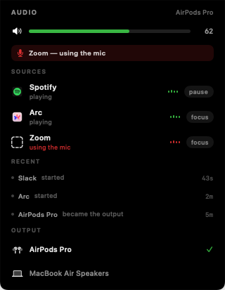

# Audio Notch

A per-app audio HUD that lives on your Mac's screen edge — or wrapped around the
notch. It shows every app currently making sound, which one is using the mic,
system volume, and your output devices, and lets you act on them without hunting
through System Settings.




## What it can and cannot do

macOS 14.4 made the per-process audio objects public, so **"who is making sound
right now" is a real query** rather than a guess:

```
kAudioHardwarePropertyProcessObjectList   -> every process using audio
kAudioProcessPropertyIsRunningOutput      -> ...and whether it is playing
kAudioProcessPropertyIsRunningInput       -> ...or recording you
```

CoreAudio also pushes notifications on those properties, so the pill reacts the
moment a track starts instead of a poll interval later.

What macOS does **not** offer is per-application volume. Apps like SoundSource do
it by installing a virtual audio driver, which is a different kind of product. So
control here is honest about the boundary:

- **Volume, mute, output device** — public CoreAudio properties, fully supported.
- **Play/pause** — for the apps that expose it to scripting (Spotify, Music,
  Podcasts, TV). Their row shows a `pause` chip.
- **Everything else** — a `focus` chip that brings the app forward so you can deal
  with it. This is deliberately the fallback for browsers: there is no supported
  way to mute one tab from outside the browser.

Browser and Electron helpers are folded into their parent app, so a noisy tab
shows up as "Arc", not three anonymous renderer processes. Apps only appear once
they have actually made a sound — the raw process list is mostly idle daemons —
and linger for a few seconds after going quiet so rows do not flicker between
tracks.

## Beyond what Control Center shows

macOS already lists media apps in Now Playing. That list comes from MediaRemote, so
it only ever contains apps that publish now-playing info — a game, a Zoom call, or a
random tab making noise never appear. This reads the audio hardware instead, so it
sees all of them, and adds the things that list cannot answer:

- **Live level meters.** One CoreAudio process tap per playing app, gathered into a
  private aggregate device, reduced to an RMS. Nothing is recorded or written; only a
  number per app reaches the UI. macOS hands out silent buffers until you allow audio
  recording, and the panel says so rather than drawing flat bars.
- **A rolling history.** Every start and stop is logged, so "what was that sound?" is
  answerable after the app has gone quiet again.
- **A watchdog.** The green dot says something is recording and refuses to name it.
  The panel names the app holding the mic, and flags the camera via CoreMediaIO
  (which reports that a camera is live but not which app owns it, so the mic user is
  used for attribution).
- **Follow new devices.** Connect AirPods and output switches to them. Toggle it off
  in the menu if you would rather choose every time.

## Sharing the notch

Several of these widgets can run at once. Each publishes the strip of screen it
occupies to `~/Library/Application Support/NotchWidgets/claims.json`, and the
others step around it. An island is pinned to the hardware notch and cannot move,
so everyone yields to it; otherwise the alphabetically earlier bundle id keeps its
spot, which makes the outcome stable instead of a shoving match.

## Build and run

```bash
./run.sh
```

No Xcode required — SwiftPM plus a hand-assembled bundle. macOS 14.4+ (the
per-process audio API), Swift 5.9+.

### Diagnostics

```bash
./build/AudioNotch.app/Contents/MacOS/AudioNotch --dump          # what CoreAudio reports
./build/AudioNotch.app/Contents/MacOS/AudioNotch --render ./docs --demo
AUDIONOTCH_DEBUG=1 ./build/AudioNotch.app/Contents/MacOS/AudioNotch
```

## Interaction

- **hover** — opens the panel
- **click a source** — pause it, or bring it to the front
- **click the volume bar** — set volume at that point; click the speaker to mute
- **click a device** — switch output
- **drag** — move it along its edge, or throw it at another edge
- **right-click** — display, edge, position, work mode, quit

## Layout

```
main.swift              entry point, --dump / --render modes
UI/NotchController      panel, status item, click routing, drag, claims
UI/AudioRootView        pill and panel
UI/NotchClaims          multi-widget collision avoidance
UI/{NotchPanel,NotchGeometry,Placement,Layout,NotchState,Interaction,Components}
                        the notch shell, shared with usage-notch
Providers/CoreAudioKit  typed wrappers over the CoreAudio property API
Providers/AudioMonitor  who is playing, with live listeners
Providers/AudioControls volume, mute, device switching, transport, focus
```

## License

MIT — see [LICENSE](LICENSE).
